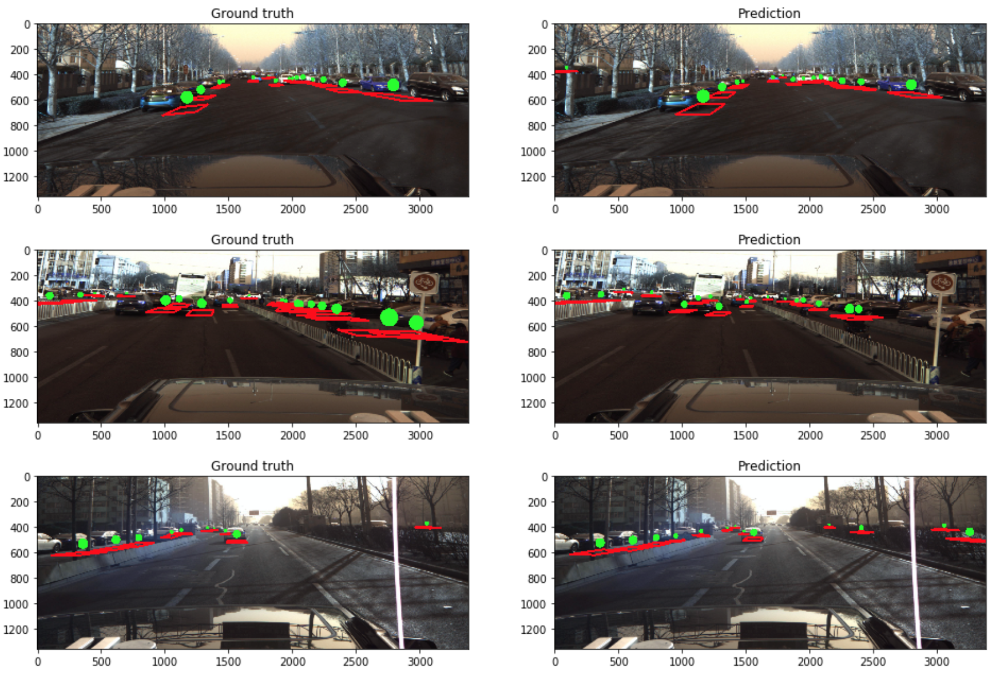

# Autonomous Car Object 

This project is a implementation of CenterNet algorithm in the object detection and pose prediction set up.
## Problem
This project uses a dataset published by Baidu and PKU that includes thousands of photos taken on top of a self-driving car on the street. The task is to identify other vehicles in the photos and also extract their 3D coordinates and movement (Yaw-Roll-Pitch). 

Here are some example photos comparing the prediction from the CenterNet model and the ground truth.
